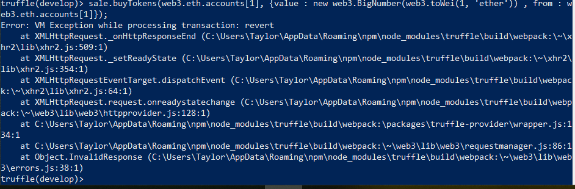
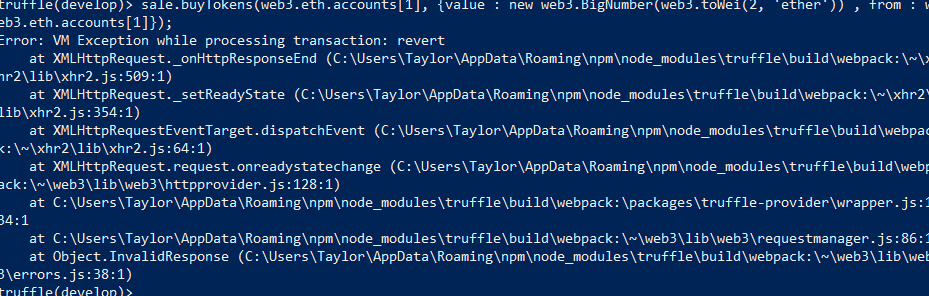
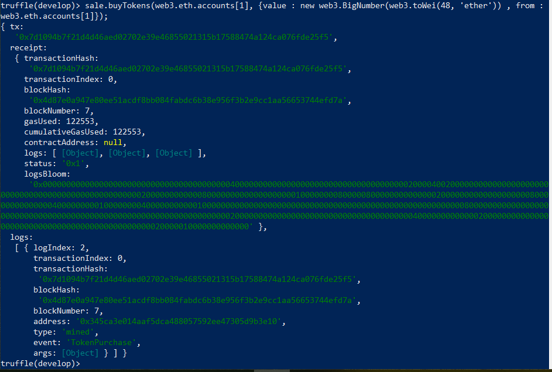
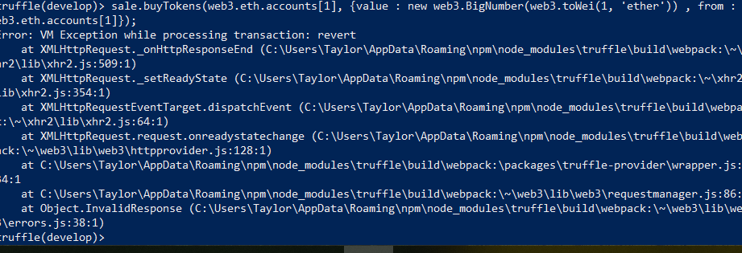

<h1> TutorialCrowdsaleToken </h1>
Author: Taylor McNeil

This program was created in conjunction with a medium article: https://medium.com/crowdbotics/how-to-build-a-simple-capped-crowdsale-token-using-openzeppelin-library-part-1-2789ec642308.  
The purpose was to create a crowd sale token that had a minimum investment of 5 Ether and a maximum investment of 50 Ether.  
The program requires Truffle v. 4.1.15 && Solidity 0.4.25.  
Note: The second question was not answered for this assignment.  

<h2> Installation </h2>
<ul>
<li> Install Node.js </li>
  --You need this to use the npm  
  --Link: https://nodejs.org/en/download/  
 <li> Install Truffle v.4.1.15</li> 
  --npm install -g Truffle@4.1.15  
  <li> Install OpenZeppelin v 1.10.0 (Optional, the files are already included) </li>
  --npm install openzeppelin-solidity@1.10.0  
 <li> Clone or download the repository </li> 
<li> Profit! </li> 
 </ul>

<h2> Usage </h2>
<li> Open the terminal or cmd </li>
<li> Navigate to where you cloned or downloaded the repository </li>
<li> Type truffle compile </li>
   --A list of warnings should come up, everything is fine </li>
<li>Type truffle develop </li>  
<li> Deploy your token with the rate, a wallet and a cap </li>
   --Start trading!
   
<h2> Solutions </h2>
<li> Defining parameters </li>

   

<li>Change the minimum contribution to 5 Ether </li>

   

<li>Try to buy tokens with 2.5 Ether (Failure) </li>

   

<li>Buy Tokens with 15 Ether (Sucess) </li>

   

<li> Return how many tokens are left </li>

   

<li> Buy tokens(again) with 25 Ether 

  
 <li> Tutorial Tests </li> 
  

  
   
  
  

